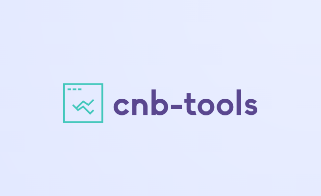

<p align="center"><em>
  Convenience tools/functions for challenges and benchmarking on
  <a href="https://www.synapse.org" title="Synapse.org">Synapse.org</a>
</em></p>

<p align="center">
  <a href="https://pypi.org/project/cnb-tools/" title="cnb-tools on PyPI">
    
  </a>
  
  <a href="https://github.com/Sage-Bionetworks-Challenges/cnb-tools/blob/main/LICENSE" title="License">
    
  </a>
</p>

---

**Documentation**: [https://sage-bionetworks-challenges.github.io/cnb-tools]

**Source code**: [https://github.com/Sage-Bionetworks-Challenges/cnb-tools]

---

**cnb-tools** is a set of tools and commands that provides an interface
for managing crowd-sourced challenges hosted on Synapse.org, including
but not limited to, [DREAM Challenges].

## Requirements

- [Python 3.10+]
- [Synapse account]

To fully utilize **cnb-tools**, you must have a Synapse account and
provide your credentials to the tool. First, generate a Synapse
[Personal Access Token (PAT)] with all token permissions enabled.

Next, run the following command, then follow the prompts to enter
your Synapse username and PAT:

```console
synapse config
```

This will create a `.synapseConfig` file in your home directory. For
security, we recommend updating its permissions so that other users
on your machine do not have read access to your credentials, e.g.

<!-- termynal -->
```console
$ chmod 600 ~/.synapseConfig
$ ls -l ~/.synapseConfig
-rw-------@ 1 user  staff  123 Jan  1 12:00 .synapseConfig
```

## Installation

For best practice, use a Python environment to install **cnb-tools**
rather than directly into your base env.  In our docs, we will be
using [miniconda], but you can use [miniforge], [venv], [pyenv], etc.

<!-- termynal -->
```console
# Create a new env and activate it
$ conda create -n cnb-tools python=3.12 -y
---> 100%
$ conda activate cnb-tools

# Install cnb-tools using pip
(cnb-tools) $ pip install cnb-tools
---> 100%
Successfully installed cnb-tools
```

!!! note
    **cnb-tools** builds off of the Synapse Python Client — by
    installing **cnb-tools**, you will also be installing **synapseclient**.
    
    → [Read its docs.]

Verify the installation with:

<!-- termynal -->
```console
(cnb-tools) $ cnb-tools
Manage challenges on Synapse.org from the CLI

Enter `cnb-tools --help` for usage information.
```

## Running With Docker

If you rather not install `cnb-tools` onto your machine, you may still use it
via Docker!  The package and list of versions are [available here].

To provide your Synapse credentials to the Docker container, you must first
create a file with your Synapse PAT as the `SYNAPSE_AUTH_TOKEN` environment
variable:

```yaml
SYNAPSE_AUTH_TOKEN=<YOUR PAT>
```

The `docker run` command will look something like this, assuming the file is
named `~/.synapse-config`:

<!-- termynal -->
```console
$ docker run --rm \
    --env-file ~/.synapse-config \
    ghcr.io/sage-bionetworks-challenges/cnb-tools \
    COMMAND [ARGS]
```

## License

**cnb-tools** is released under the Apache 2.0 license.

[https://sage-bionetworks-challenges.github.io/cnb-tools]: https://sage-bionetworks-challenges.github.io/cnb-tools
[https://github.com/Sage-Bionetworks-Challenges/cnb-tools]: https://github.com/Sage-Bionetworks-Challenges/cnb-tools
[DREAM Challenges]: https://dreamchallenges.org/
[Python 3.10+]: https://www.python.org/downloads/
[Synapse account]: https://www.synapse.org/#!LoginPlace:0
[Personal Access Token (PAT)]: https://www.synapse.org/#!PersonalAccessTokens:
[miniconda]: https://docs.conda.io/projects/miniconda/en/latest/miniconda-install.html
[miniforge]: https://github.com/conda-forge/miniforge
[venv]: https://docs.python.org/3/library/venv.html
[pyenv]: https://github.com/pyenv/pyenv
[Read its docs.]: https://python-docs.synapse.org/
[available here]: https://github.com/Sage-Bionetworks-Challenges/cnb-tools/pkgs/container/cnb-tools
